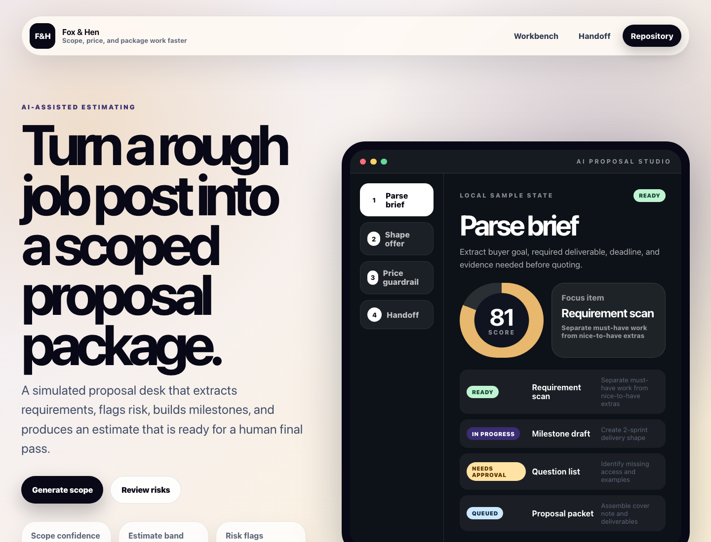

# AI Proposal Studio

Fox & Hen public-safe proposal/scoping assistant for turning a rough opportunity into a structured client proposal package.



## Live Demo

- Demo: [https://foxhen-ai-proposal-studio.vercel.app](https://foxhen-ai-proposal-studio.vercel.app)
- Repository: [https://github.com/foxandhenllc/foxhen-ai-proposal-studio](https://github.com/foxandhenllc/foxhen-ai-proposal-studio)

## What It Does

- Captures client intake: problem, goal, audience, workflow, systems, budget signal, timeline, and success metric.
- Structures proposal scope: assumptions, exclusions, deliverables, acceptance criteria, timeline, and risk flags.
- Calculates a transparent complexity score, client-facing price range, and private internal estimate view.
- Exports a client-friendly Markdown proposal, AI prompt pack JSON, and full proposal snapshot JSON.
- Autosaves the editable project in browser localStorage, with reset-to-sample and portable project JSON import/export.
- Runs fully static in React + TypeScript + Vite with no backend, auth, secrets, real data, or live model calls.

## Use Cases

- Scope an AI automation or internal tooling opportunity before writing a full SOW.
- Produce a buyer-readable first-pass proposal from fictional or client-approved inputs.
- Keep internal estimate math separate from client-facing proposal language.
- Generate reusable prompt packs for later human-reviewed AI workflows.

## Source Map

- `src/data/proposalFixture.ts`: fictional sample proposal data.
- `src/lib/proposalTypes.ts`: proposal domain types.
- `src/lib/proposalEngine.ts`: complexity, pricing, and internal estimate logic.
- `src/lib/localProject.ts`: browser-only localStorage and project JSON helpers.
- `src/exporters/markdown.ts`: client-friendly proposal export.
- `src/exporters/json.ts`: AI prompt pack and proposal snapshot exports.
- `src/components`: proposal builder UI components.
- `tests/proposal-export.smoke.ts`: fixture-based smoke test for proposal, Markdown, and JSON export generation.

## Client Customization

1. Start from `docs/client-brief-template.md` and collect only fictional or client-approved facts.
2. Replace the sample scenario in `src/data/proposalFixture.ts`.
3. Tune scoring or pricing in `src/lib/proposalEngine.ts` if the service line needs different assumptions.
4. Adjust Markdown or JSON export wording in `src/exporters`.
5. Review `docs/public-safe-data.md` before publishing screenshots, exports, or forks.

## SEO / AIO Discoverability

**Plain-language answer:** Use this repo to structure scoping, assumptions, exclusions, timelines, risk flags, estimate bands, and prompt-pack exports.

**Who it helps:** consultants and agencies scoping AI, automation, or software work.

**Search intents covered:**

- AI proposal builder
- structured proposal generator
- scope assumptions exclusions tool
- freelance proposal studio

**Why this repo is useful:** It improves proposal quality by making scope, risk, price logic, and acceptance criteria explicit before sending.

## Local Run

```bash
npm install
npm run dev
```

## Validation

```bash
npm test
npm run typecheck
npm run build
```

A copy-ready CI workflow lives at `docs/github-actions/build.yml.example`; move it to `.github/workflows/build.yml` after GitHub auth has the `workflow` scope.

## Public-Safe Scope

This is a static frontend demo with fictional fixture data. It includes no production data, credentials, real contacts, backend, auth, external service calls, or live AI model calls.

## License

MIT — see `LICENSE`.
